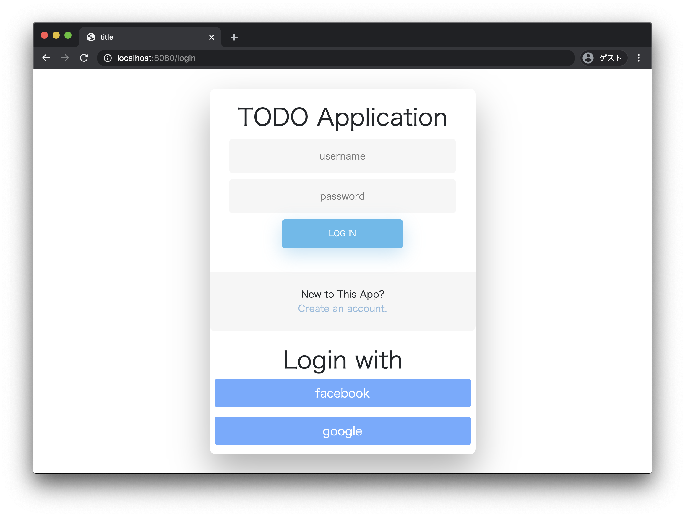

<h1 align="center">ojt.todoApp2020</h1>

2020 年の ojt 用に作成するサンプルアプリです。
枯れた技術をベースに、なるべく新しいものを組み込んでいるつもり。

## 使用技術

- editorconfig

### アプリケーション

#### バックエンド

- java 11
- springBoot RELEASE 2.3.0
  - springSecurity
  - spring data jpa
- gradle
- lombok
- flyway

#### フロントエンド

- yarn
- eslint
- prettier
- webpack
- bootstrap4

### インフラストラクチャ

- vagrant
- centos/8
- mysql8.0.17

## How to Build Local Env

1. Install Java 11, npm, yarn, vagrant, vurtualBox and Gradle. Gradle is Option.
 (If you don't want to install Gradle, use `./gradlew`).
2. Move to root of project.
3. Type `vagrant up`.
4. Type `yarn install`.
5. Type `yarn run build`.
6. Run App by `main\java\com\example\ojt\todoApp2020\Application.java`
 If you want to use CLI, type `gradle bootRun --args='--spring.profiles.active=dev'`

