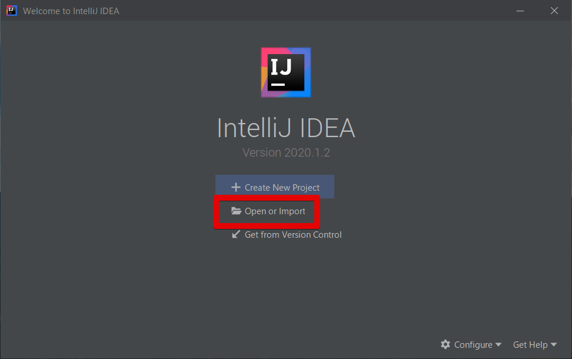
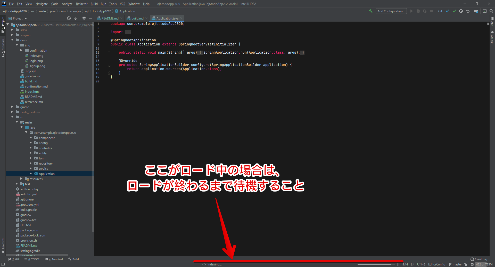
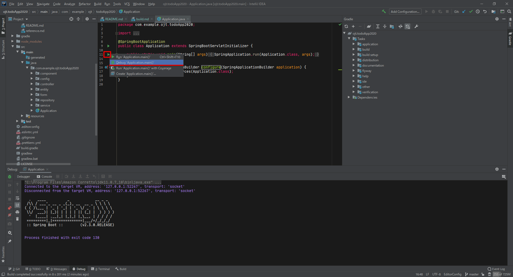
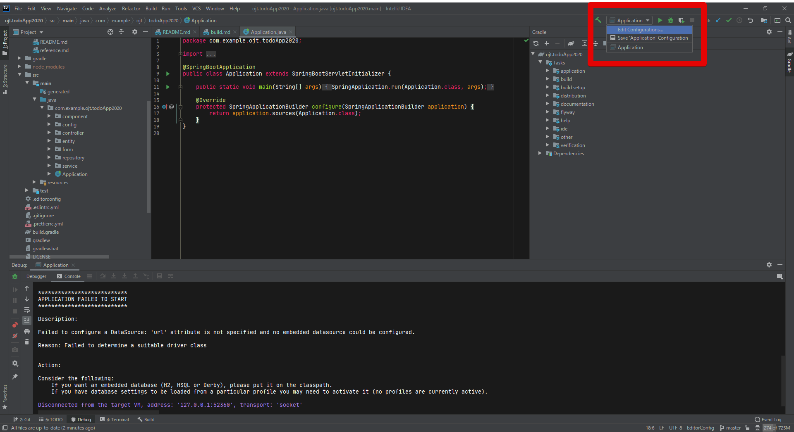
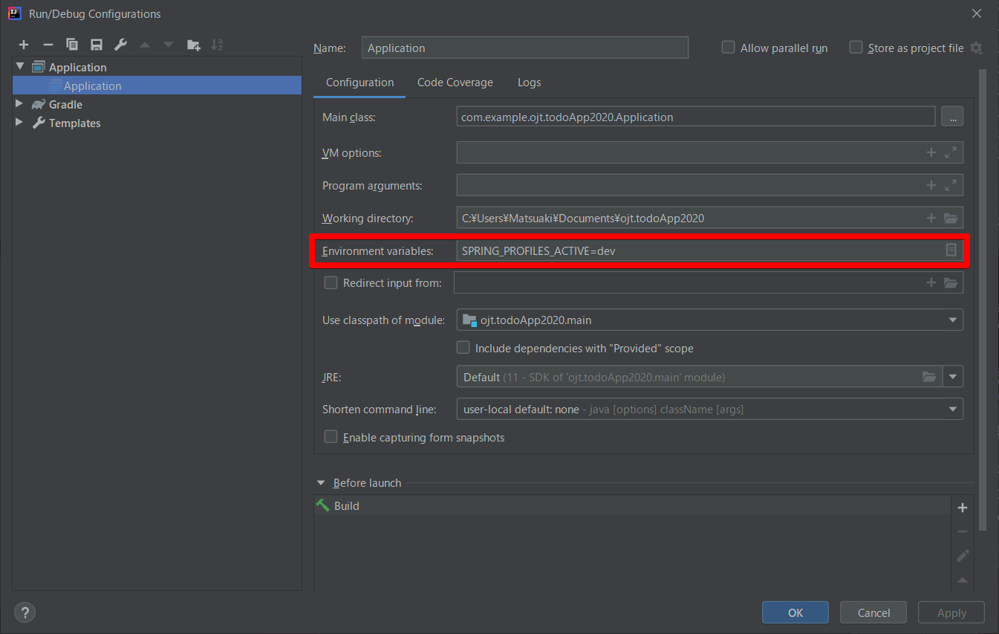

# サンプルアプリを動かしてみる

1. Step0 にて指定した各種ソフトウェアをインストールする
2. Git を使って、Repository から clone を行う。<br>`git clone https://github.com/matsu4ki/ojt.todoApp2020.git`
3. CLI を開き、プロジェクトのファイルまで移動する
4. `vagrant up`を入力する
5. vagrant の起動が始まるので、完了するまで待機する
6. `yarn install`を入力する
7. フロントエンドで利用するパッケージ群がインストールされるので待機する
8. `yarn run build`を入力する
9. package.json 内に記述しているビルド用スクリプトが走るので待機する

## CLI上でサーバーを起動する

CLI を利用する場合は以下のコマンドを入力してあげると、サーバーが起動します。

 ```bash
gradle bootRun --args='--spring.profiles.active=dev'
```

## IntelliJ上でサーバーを起動する

IntelliJ を開き、Open or Import を選択する。
ウィンドウが出てくるので、`git clone`にてダウンロードしたプロジェクトファイルを指定する。



ロード完了後、以下パスにある Application.java を開き、下図の▶ボタンを押す。



```text
実行するファイルの保存場所
src/
└── main
    └── java
        └── com
            └── example
                └── ojt
                    └── todoApp2020
                        └── Application.java
```



起動が失敗することを確認する。


これは、環境を dev 環境にしていないことが原因なので、起動時のオプションを設定します。

!>プロジェクトには基本的に、複数の環境が存在します。環境を分けている理由としては、実際に動作させるときと、ローカルで動かすときなどでシステムの配置や設定が変わってくるからです。一般的には、「dev(development)環境、stg(staging)環境、prod(production)環境」が存在します。





