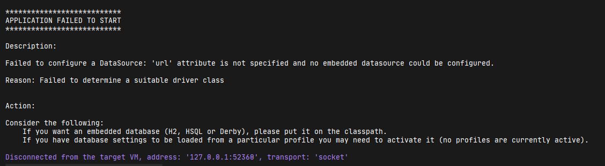

# サンプルアプリを動かす

1. Step0にて指定した各種ソフトウェアをインストールする
2. gitを使って、Repositoryからcloneを行う。<br>`git clone https://github.com/matsu4ki/ojt.todoApp2020.git`
3. CLIを開き、プロジェクトのファイルまで移動する
4. `vagrant up`を入力する
5. vagrantの起動が始まるので、完了するまで待機する
6. `yarn install`を入力する
7. フロントエンドで利用するパッケージ群がインストールされるので待機する
8. `yarn run build`を入力する
9. package.json内に記述しているビルド用スクリプトが走るので待機する

## CLI上でサーバーを起動する

CLIを利用する場合は以下のコマンドを入力してあげると、サーバーが起動します。
 
 ```bash
gradle bootRun --args='--spring.profiles.active=dev'
```

## IntelliJ上でサーバーを起動する

IntelliJを開き、Open or Importを選択する。


ロード完了後、以下のPathにあるApplication.javaを開き、下図の▶ボタンを押す。


```text
実行するファイルの保存場所
src/
└── main
    └── java
        └── com
            └── example
                └── ojt
                    └── todoApp2020
                        └── Application.java
```


起動が失敗することを確認する。



これは、環境をdev環境にしていないことが原因なので、起動時のオプションを設定します。

!>プロジェクトには基本的に、複数の環境が存在します。環境を分けている理由としては、実際に動作させるときと、ローカルで動かすときなどでシステムの配置や設定が変わってくるからです。一般的には、「dev(development)環境、stg(staging)環境、prod(production)環境」が存在します。


