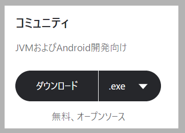

# 開発環境を構築する

以下のソフトウェアをインストールしてください。
ダウンロードページが分からなかった場合、直リンクも掲載しているのでそちらからダウンロードしてください。
また、複数のインストーラー(x86 と x64)がある場合は、x64 の方をインストールしてください。

!>パスが通っているか？」は、通常コマンドラインでインストールしたソフトウェアのコマンドが使えるかどうかを確認しています。
Path がよくわからない方は[こちらの解説記事](https://wa3.i-3-i.info/word1166.html)がわかりやすいので確認してください。

## Java 11

Java はさまざまな会社から提供されておりますが、
今回は Amazon が提供している、AmazonCorretto を利用します。

- [Javaの概要](http://www.tohoho-web.com/java/about.htm)

- ダウンロード
  - [Amazon Correttoのダウンロードページ](https://aws.amazon.com/jp/corretto/)
  - [直リンク](https://corretto.aws/downloads/latest/amazon-corretto-11-x64-windows-jdk.msi)

### Pathが通っているかの確認

1. powserShell を開きます(Windows + R を押した後、powershell と入力して実行する)
2. `java -version`と入力します
3. 以下の内容が表示されていれば成功です。

```powershell
PS C:\Users\user> java -version
openjdk version "11.0.7" 2020-04-14 LTS
OpenJDK Runtime Environment Corretto-11.0.7.10.1 (build 11.0.7+10-LTS)
OpenJDK 64-Bit Server VM Corretto-11.0.7.10.1 (build 11.0.7+10-LTS, mixed mode)
```

コマンドがうてるかを確認するためにバージョン表示オプションをつけて利用しています。
バージョンを表示するためのオプションは基本的にどのコマンドにもついており、`command -v`、`command --version`、`command version`であることが多いです。
また、ハイフン 1 つは省略形で、ハイフン 2 つは正式名称であることが多いです。
なので、java のバージョン表示は少し独特です。

## VirtualBox

仮想サーバーを立てるためのソフトウェアです。

- ダウンロード
  - [VirtualBoxのダウンロードページ](https://www.virtualbox.org/wiki/Downloads)
  - [直リンク](https://download.virtualbox.org/virtualbox/6.1.10/VirtualBox-6.1.10-138449-Win.exe)

## Vagrant

VirtualBox を CLI 上から操作するためのソフトウェアです。

- ダウンロード
  - [Vagrantのダウンロードページ](https://www.vagrantup.com/downloads.html)
  - [直リンク](https://releases.hashicorp.com/vagrant/2.2.9/vagrant_2.2.9_x86_64.msi)

### Pathが通っているかの確認

1. powserShell を開きます（Windows + R を押した後、powershell と入力して実行する）
2. `vagrant -v`と入力します
3. 以下の内容が表示されていれば成功です。

```powershell
PS C:\Users\user> vagrant -v
Vagrant 2.2.9
```

## A5:SQL Mk-2

DataBase(DB)を GUI 上で操作できるソフトウェアです。

- ダウンロード
  - [A5:SQL Mk-2のダウンロードページ](https://a5m2.mmatsubara.com/)
  - [直リンク](https://ftp.vector.co.jp/72/92/2526/a5m2_2.15.0_x64.zip)

## MySQL

MySQL は Oracle 社が主に提供している、OSS の Database です。
詳細が気になる人は、[このサイト](https://www.publickey1.jp/blog/10/mysql_2.html#:~:text=MySQL%E3%81%AF%E3%81%99%E3%81%A7%E3%81%AB%E5%A4%A7%E3%81%8D%E3%81%8F2,MariaDB%E3%80%8D%E3%81%AE%E9%96%8B%E7%99%BA%E3%82%92%E9%96%8B%E5%A7%8B%E3%80%82)
が参考になるので、読んでみてください。

Database は仮想環境内に構築するため、本サンプルでのインストールは不要です。

## Git

バージョン管理を行うためのソフトウェアです。
バージョン管理や Git については、以下のリンクを参考にしてください。

[Gitを使ったバージョン管理｜サル先生のGit入門【プロジェクト管理ツールBacklog】](https://backlog.com/ja/git-tutorial/intro/01/)

- ダウンロード
  - [Gitのダウンロードページ](https://git-scm.com/)
  - [直リンク](https://git-scm.com/download/win)

### Pathが通っているかの確認

1. powserShell を開きます（Windows + R を押した後、powershell と入力して実行する）
2. `git -v`と入力します
3. 以下の内容が表示されていれば成功です。

```powershell
PS C:\Users\user> git --version
git version 2.25.1.windows.1
```

## IntelliJ IDEA CE

JetBrains 社が開発した IDE です。
IDE とは統合開発環境のことで、開発を行う上で必要なものまるっと 1 つのソフトウェアとして提供されております。
類似の IDE として、Eclipse がありますが、本サンプルではこちらを利用します。

以下画像に表示されているボタンをクリックして、コミュニティ版をダウンロードしてください。



- ダウンロード
  - [IntelliJ IDEA CEのダウンロードページ](https://www.jetbrains.com/ja-jp/idea/download/#section=windows)
  - [直リンク](https://www.jetbrains.com/ja-jp/idea/download/download-thanks.html?platform=windows&code=IIC)


## Node.js(npm)

npm を利用するために、Node.js をインストールします。
Node.js をインストールすると、npm も自動的にインストールされます。
npm とは、フロントエンド周りのパッケージ管理ソフトウェア（ソフトウェアを管理するソフトウェア）のことです。

- ダウンロード
  - [Node.jsのダウンロードページ](https://nodejs.org/ja/download/)
  - [直リンク](https://nodejs.org/dist/v12.18.1/node-v12.18.1-x64.msi)

### Pathが通っているかの確認

1. powserShell を開きます（Windows + R を押した後、powershell と入力して実行する）
2. `npm -v`と入力します
3. 以下の内容が表示されていれば成功です。

```powershell
PS C:\Users\user> npm -v
6.9.0
```

### yarn

npm を少し便利にしたパッケージ管理ソフトウェアです。
npm を利用してインストール可能です。

1. `windows + R`を押す
2. `powershell`と入力する
3. `npm install -g yarn`と入力する

これでインストールが完了します。

### Pathが通っているかの確認

1. powserShell を開きます（Windows + R を押した後、powershell と入力して実行する）
2. `yarn -v`と入力します
3. 以下の内容が表示されていれば成功です。

```powershell
PS C:\Users\user> yarn -v
1.22.4
```

## Gradle

Java のライブラリ管理ソフトウェアです。
npm の Java ライブラリ版と考えてもらっても大丈夫です。

- ダウンロード
  - [Gradleダウンロードページ](https://gradle.org/releases/)
  - [直リンク](https://gradle.org/next-steps/?version=6.5&format=all)

### Pathを通す

Gradle はインストールウィザードによるインストールがありません。
なので、手動で使えるようにしてあげる必要があります。

1. ダウンロードしてきたファイル[gradle-x.x]を`C:\Program Files`の中に移動させます
2. Windows キーを押し、「env」と入力します
3. システムのプロパティが表示されるので、「環境変数」をクリックします
4. 「user の環境変数」の中にある、パス」のラインをダブルクリックするか、クリックして「編集」ボタンをクリックします
5. 「新規」を押し、`C:\Program Files\gradle-x.x\bin`と入力した後に OK をクリックし、すべてのウィンドウを閉じます。

### Pathが通っているかの確認

1. powserShell を開きます（Windows + R を押した後、powershell と入力して実行する）
2. `gradle -v`と入力します
3. 以下の内容が表示されていれば成功です。

```powershell
PS C:\Users\user> gradle -v

Welcome to Gradle 6.5!

Here are the highlights of this release:
 - Experimental file-system watching
 - Improved version ordering
 - New samples

For more details see https://docs.gradle.org/6.5/release-notes.html


------------------------------------------------------------
Gradle 6.5
------------------------------------------------------------

Build time:   2020-06-02 20:46:21 UTC
Revision:     a27f41e4ae5e8a41ab9b19f8dd6d86d7b384dad4

Kotlin:       1.3.72
Groovy:       2.5.11
Ant:          Apache Ant(TM) version 1.10.7 compiled on September 1 2019
JVM:          11.0.7 (Amazon.com Inc. 11.0.7+10-LTS)
OS:           Windows 10 10.0 amd64
```
